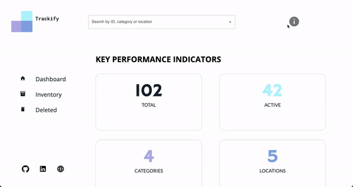

# Trackify 

Trackify is an inventory tracking web application meant for logistics companies. It allows its users to :
<ul>
  <li><b>View items</b> that are currently in the inventory (as a list or individually)</li>
  <li><b>Edit</b> and <b>delete</b> items, <b>add comments to the deletes.</b> <b>Comments can then be edited, deleted or added</b> if there aren't any. </li>
  <li><b>Search</b> for items by ID, category, location.</li>
  <li>Users can also <b>view deleted items</b> (as a list or individually) <b>recover deleted items</b> or <b>permanently delete them.</b> </li>
  <li>Every item can be viewed individually and its listing will contain information about it such as its ID, category, location (such as a warehouse number), the number of units of that particular item that are currently available, as well as the item status (i.e. whether it's active/available or deleted).</li>
</ul>

### Technologies used:

<em>Below are the technologies used <b>for the backend part only:</b></em>

- NodeJS
- Express
- MongoDB
- Mongoose

### Setup:

- This repository is for the backend code of the project only. To view the source code for the frontend please visit this [link](https://github.com/sararita28/trackify)

### Areas of improvement & potential add-ons:

- Implement user authentication
- Have a map of warehouses/locations showing the location's current capacity
- Allow users to create, edit, delete, view locations & categories
- Allow users to create “shipments” and assign inventory to the shipment.

---

 View the initial UI/UX [here](https://www.figma.com/file/nS1AQYbkfS1igPG2g45tT1/Untitled?node-id=3%3A2)

 View the project [here](https://trackify-frontend.sararita28.repl.co/)

---
